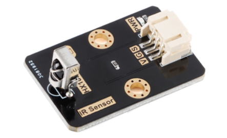
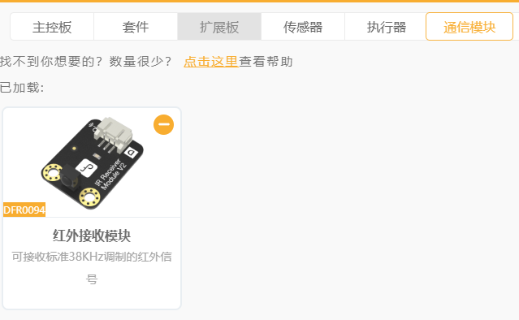
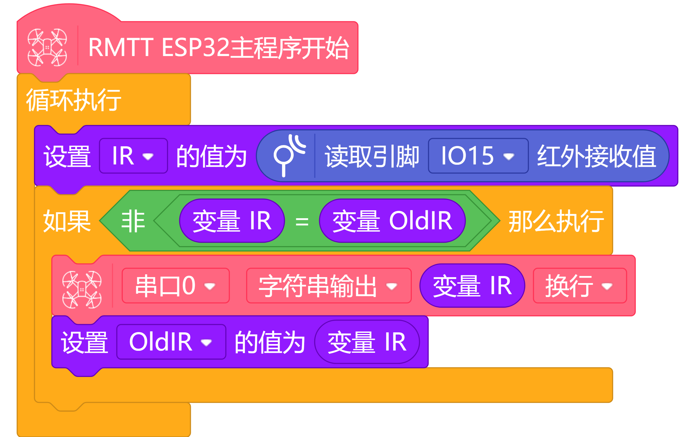
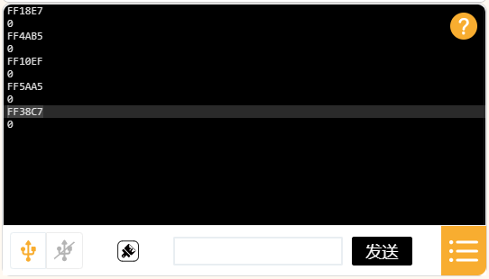
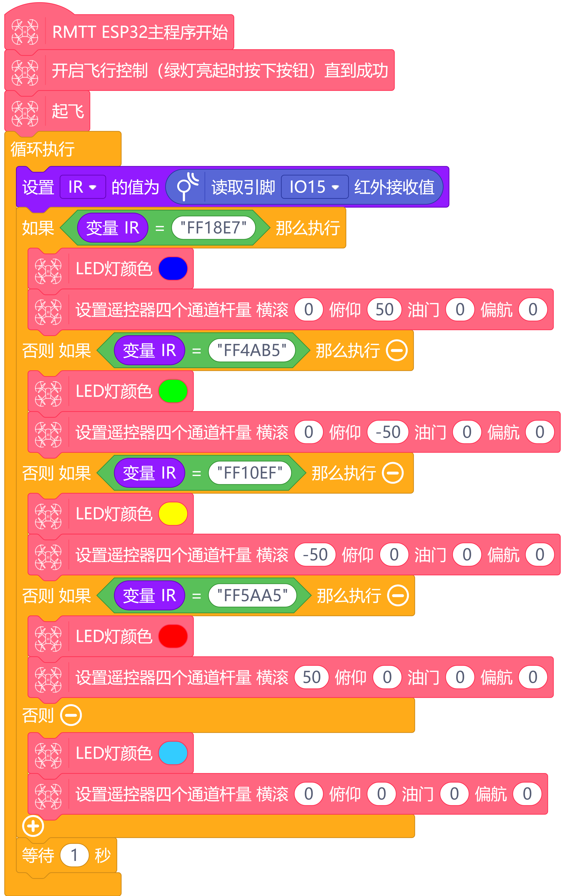

# **TT 红外接收模块**
## **简介**
  

```
    红外遥控器发出的信号是一连串的二进制脉冲码 为了使其在无线传输过程中免受其他红外信号的干扰,通常都是先将其调制在特定的载波频率上,然后再经红外发射二极管发射出去,而红外线接收装置则要滤除其他杂波,只接收该特定频率的信号并将其还原成二进制脉冲码,也就是解调.</p>

    传感器通过PH2.0-3P数字线直插TT无人机IO扩展板。产品为PH2.0-3P封装，连接方便.
```
---
## **产品参数**
<ul>
<li>接口类型:数字</li>
<li>工作电压:5V</li>
<li>接口:PH2.0-3P</li>
</ul>

---
## **安装使用教程**  
<p>
  
  
使用TT IO扩展板进行安装  
</p>
<br>
<br>

---
## **编程使用教程**
### **示例1**
```
下面演示了一个从红外接收模块获取红外遥控器功能编码的功能
```  
添加红外接收模块  
  
程序示例
  
接收示例  
  

### **示例2**
```
下面演示了一个从红外接收模块获取遥控数据控制无人机前后左右移动   
```
程序示例  
   