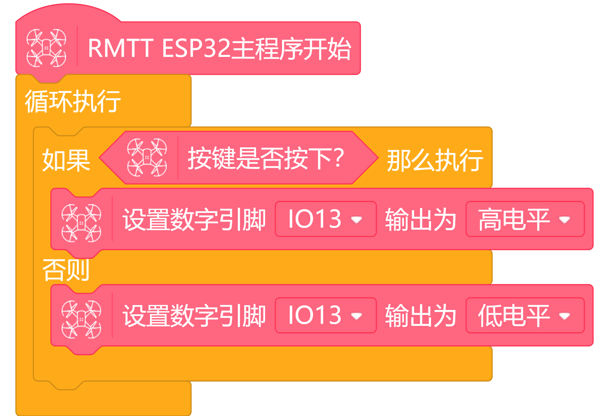

# **TT 蜂鸣器模块**
## **简介**
  

```
TT 蜂鸣器模块是针对TT无人机开源控制器专门设计的,可直接连接TT无人机开源控制器或TT IO扩展板,实现飞行器的蜂鸣警示效果.

我们这一款TT 蜂鸣器模块采用14P接口,控制引脚为IO13,通过控制相应电平高度即可驱动蜂鸣器发出蜂鸣声.
```

---
## **产品参数**
<ul>
<li>开启电平:高</li>
<li>关闭电平:底</li>
<li>工作频率:3000HZ</li>
<li>工作电流:30mA</li>
<li>工作电压:5V</li>
<li>接口:14P双排母</li>
<li>尺寸:14*16mm</li>
</ul>

---
## **安装使用教程**
  
  

两种蜂鸣器的安装方式

---
## **编程使用教程**
下面示例实现了按下TT开源控制器按键控制蜂鸣器开启效果
  