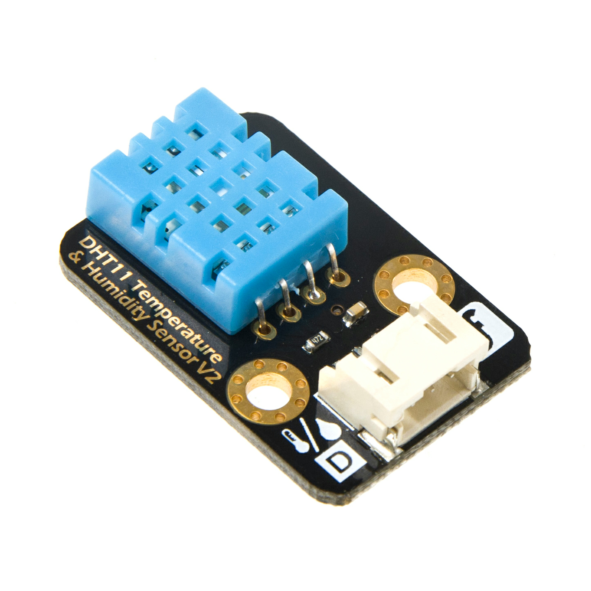
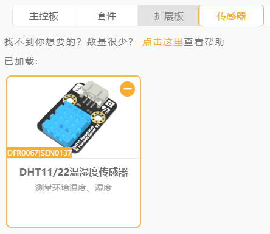
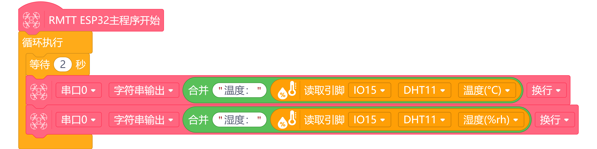
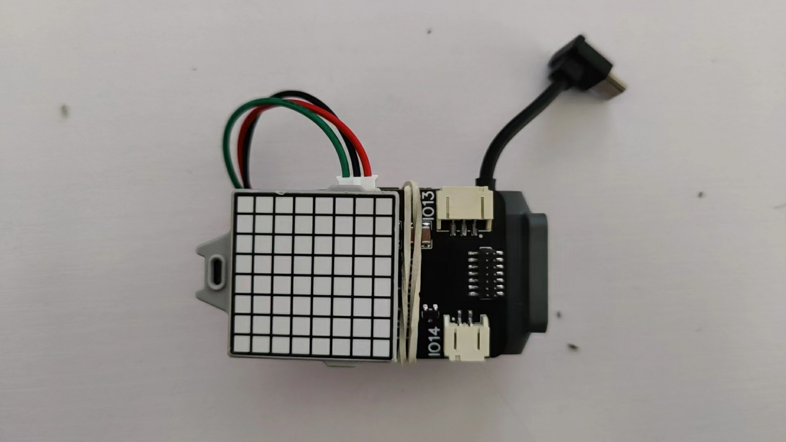
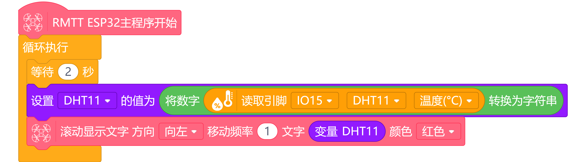
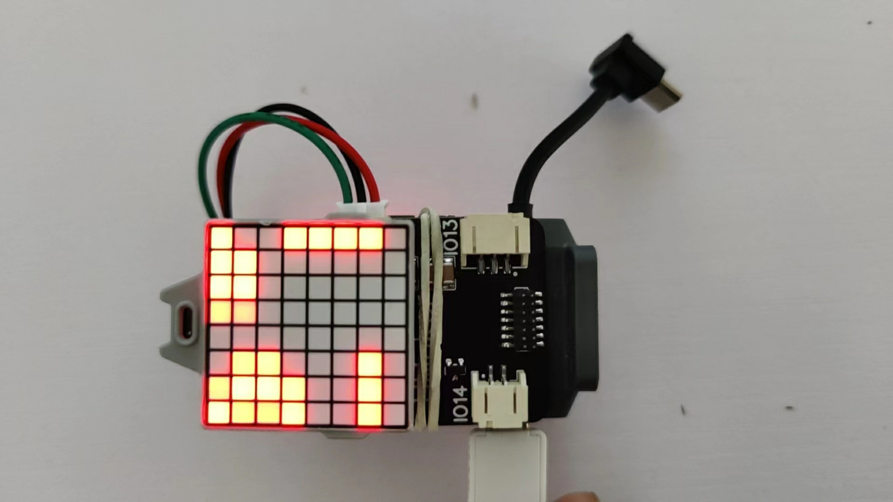

# **TT 温湿度模块**
## **简介**
  
    
        DHT11数字温湿度传感器是一款含有已校准数字信号输出的温湿度复合传感器。它应用专用的数字模块采集技术和温湿度传感技术，确保产品具有极高的可靠性与卓越的长期稳定性。传感器包括一个电阻式感湿元件和一个NTC测温元件，并与一个高性能8位单片机相连接。因此该产品具有品质卓越、超快响应、抗干扰能力强、性价比极高等优点。

        传感器通过PH2.0-3P数字线直插TT无人机IO扩展板。单线制串行接口，使系统集成变得简易快捷。再配合我们提供的代码，你可以快速搭建。超小的体积、极低的功耗，信号传输距离可达20米以上，使其成为各类应用甚至最为苛刻的应用场合的最佳选则。产品为PH2.0-3P封装，连接方便。

_____

## **产品参数**
<ul>
<li>接口类型:数字</li>
<li>温度范围：0-50℃ 误差±2℃</li>
<li>湿度范围：20-90%RH 误差±5%RH</li>
<li>工作电压:5V</li>
<li>接口:PH2.0-3P</li>
</ul>

_______

## **安装使用教程**
  
  
使用TT IO扩展板进行安装  

_______

## **编程使用教程**
### **示例1**
下面演示了一个从温湿度传感器获取温湿度信息通过串口发送给串口接收端口.  
添加温湿度模块
   
程序示例
  
接收示例
  

### **示例2**
下面演示了一个从温湿度传感器获取温度信息并通过点阵屏滚动显示温度数据.  
安装示例
   
程序示例
  
接收示例
 