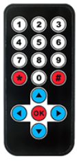

# **TT 红外遥控器**
## **简介**


```
    该红外遥控器共有17个按键,10个数字按键,4个方向按键,3个功能键.
```
<br>
<br>
<br>

---
## **产品参数**
<ul>
<li>遥控范围:8-10m</li>
<li>电池:3V纽扣电池</li>
<li>红外频率:38KHZ</li>
<li>按键寿命:2W次以上</li>
<li>重量:12g</li>
<li>尺寸:86.4*40.4mm</li>
</ul>

---
## **编码表**
|按键|编码值|按键|编码值
|--|--|--|--|
|1|FF22DD|\*|FF6897|
|2|FF629D|\#|FFB04F|
|3|FFE21D|上|FF18E7|
|4|FF22DD|下|FF4AB5|
|5|FF02FD|左|FF10EF|
|6|FFC23D|右|FF5AA5|
|7|FFE01F|OK|FF38C7|
|8|FFA857|
|9|FF906F|
|0|FF9867|