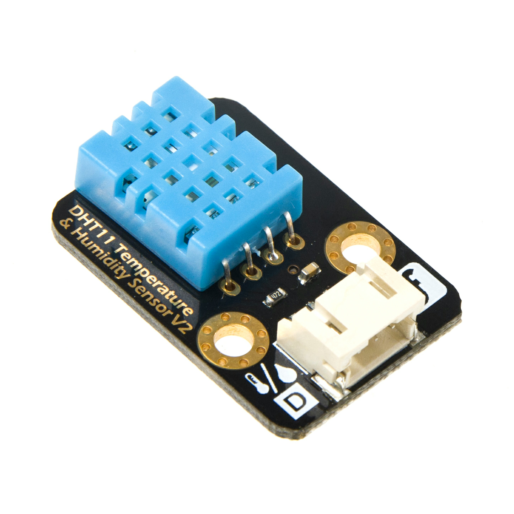
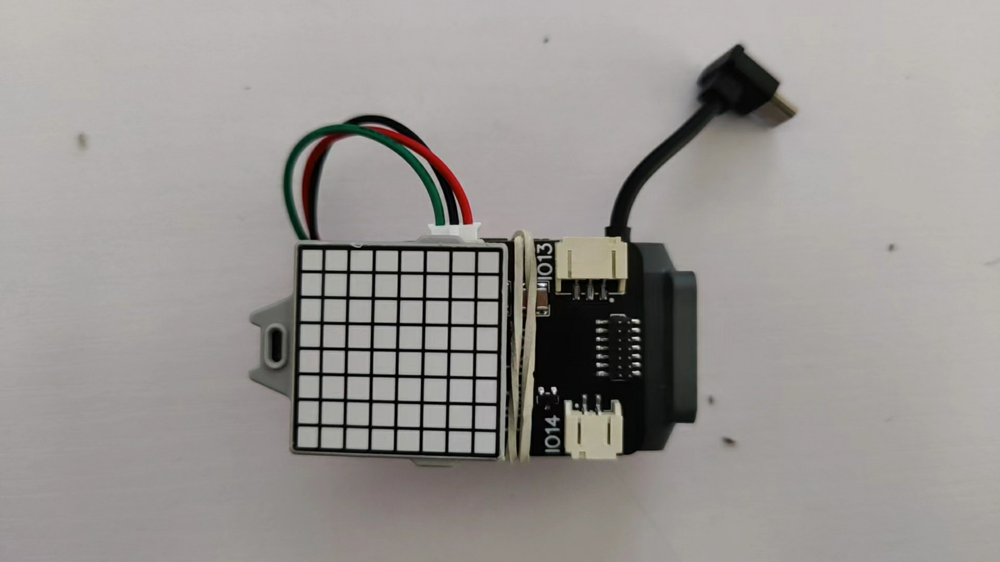
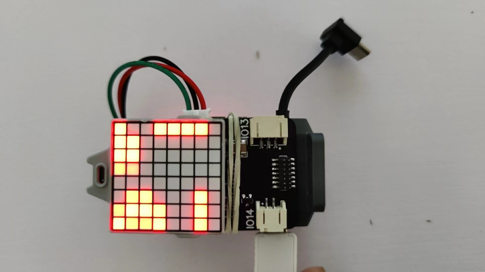

# **TT Temperature and Humidity Module**
## **Introduction**
  
    
        DHT 11 Digital temperature and humidity sensor is a temperature and humidity composite sensor with calibrated digital signal output. It uses specialized digital module acquisition technology and temperature and humidity sensing technology to ensure that the product has extremely high reliability and excellent long-term stability. The sensor includes a resistive humidity-sensing element and an NTC temperature-measurement element. It is connected with a high performance 8-bit microU. Therefore, the product has  excellent quality, super fast response, strong anti-interference ability and high cost performance.

        The sensor is inserted directly into the TT IO expansion board through the PH2.0-3P digital cable. Single-line serial interface makes the system integration easy and fast. With the code we provide, you can build it quickly. Ultra-small volume, very low power consumption, the signal transmission distance can reach more than 20 meters, making it the best choice for all kinds and even the most demanding applications. The product is packed with PH2.0-3P and easy to connect.

_____

## **Product specs**
<ul>
<li>Interface type: number</li>
<li>Temperature range: 0-50℃ error range± 2℃ </li>
<li>Humidity range: 20-90% RH error range ± 5% RH </li>
<li>Operating voltage: 5V</li>
<li>interface: PH2.0-3P</li>
</ul>

_______

## **Installation Tutorial**
  
  
Install by using the TT IO expansion board 

_______

## **Programming tutorial**
### **Example 1**
```
It demonstrates that how to obtain temperature and humidity information from the T/H sensor and send it to the serial receiving port through the serial port.
Add the temperature and humidity module on Mind+ 
```
   

Programming example

  

Receive example

  

### **Example 2**
```
It demonstrates receiving temperature information from the temperature and humidity sensor and scroll the temperature data through the dot matrix screen.
```
Installation example
   
Programming example
  
Receive example
 