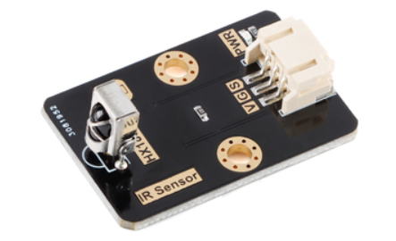

# **TT IR Module**
## **Introduction**
  

```
    The infrared remote control sends out a series of binary pulse codes. In order to avoid interference from other infrared signals during wireless transmission, it is usually first modulated on a specific carrier frequency, and then transmitted by infrared emitting diode, while infrared receiving device needs to filter out other clutter, only receiving the signal of the specific frequency and restore it to binary pulse code, that is, demodulation.

    The sensor is inserted directly into the TT IO expansion board through the PH2.0-3P digital cable. The product is packed with PH2.0-3P and easy to connect.
```
---
## **Product specs**
<ul>
<li>Interface type: Digital </li>
<li>Operating voltage: 5V </li>
<li>Interface: PH2.0-3P</li>
</ul>

---
## **Installation Tutorial**  
<p>
  
  
Install by using the TT IO expansion board  
</p>
<br>
<br>

---
## **Programming tutorial**
### **Example 1**
```
It demonstrates a feature to get the function code of infrared remote control from infrared receiving module.
```  
Add the infrared receiving module on Mind+
  

Programming example

  

Receive example  

  

### **Example 2**
```
It demonstrates that controlling the forward, backward, left and right movement of the drone by obtaining the remote control data from the infrared receiving module.
```
Programming example

   