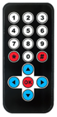

# **TT Infrared Remote Controller**
## **Introduction**


```
    The infrared remote controller has 17 keys, including 10 digital keys, 4 directional keys and 3 function keys.
```
<br>
<br>
<br>

---
## **Product specs**
<ul>
<li>Remote control range: 8-10m </li>
<li>Battery: 3V button battery </li>
<li>IR Frequency: 38 KHZ </li>
<li>Key life: more than 2W times</li>
<li>Weight: 12g</li>
<li>Dimension: 86.4*40.4mm</li>
</ul>

---
## **Coding table**
|Key|Value|Key|Value
|--|--|--|--|
|1|FF22DD|\*|FF6897|
|2|FF629D|\#|FFB04F|
|3|FFE21D|Up|FF18E7|
|4|FF22DD|Down|FF4AB5|
|5|FF02FD|Left|FF10EF|
|6|FFC23D|Right|FF5AA5|
|7|FFE01F|OK|FF38C7|
|8|FFA857|
|9|FF906F|
|0|FF9867|